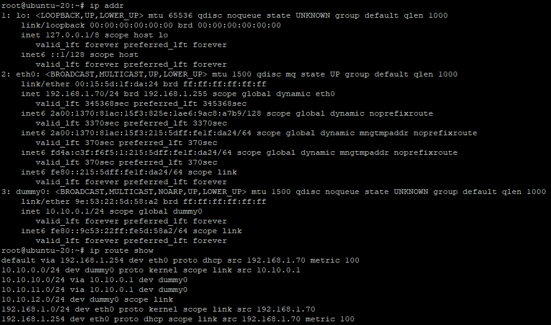
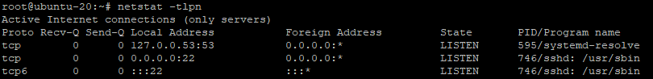
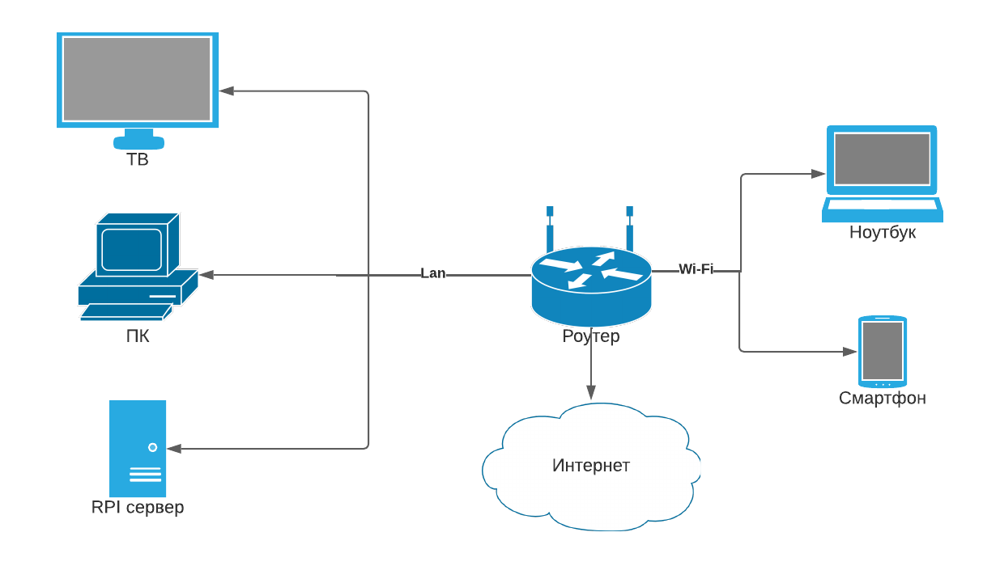

# Домашнее задание к занятию "3.8. Компьютерные сети, лекция 3"
1. При использовании команды ```show ip route 50.7.93.84/32``` выдаёт ошибку, вместо неё использовал команду ```show ip route 50.7.93.84```:
```
route-views>show ip route 50.7.93.84/32
                                    ^
% Invalid input detected at '^' marker.

route-views>show ip route 50.7.93.84
Routing entry for 50.7.92.0/22
  Known via "bgp 6447", distance 20, metric 10
  Tag 3257, type external
  Last update from 89.149.178.10 7w0d ago
  Routing Descriptor Blocks:
  * 89.149.178.10, from 89.149.178.10, 7w0d ago
      Route metric is 10, traffic share count is 1
      AS Hops 2
      Route tag 3257
      MPLS label: none
```
   При использовании команды ```show bgp x.x.x.x/32```, выдаёт "% Network not in table", вместо неё использовал команду ```show bgp 50.7.93.84```:
```
route-views>show bgp 50.7.93.84/32
% Network not in table
route-views>show bgp 50.7.93.84
BGP routing table entry for 50.7.92.0/22, version 400913966
Paths: (23 available, best #23, table default)
  Not advertised to any peer
  Refresh Epoch 1
  4901 6079 3257 174
    162.250.137.254 from 162.250.137.254 (162.250.137.254)
      Origin IGP, localpref 100, valid, external
      Community: 65000:10100 65000:10300 65000:10400
      path 7FE18CDDC5E8 RPKI State not found
      rx pathid: 0, tx pathid: 0
  Refresh Epoch 1
  3267 1299 174
    194.85.40.15 from 194.85.40.15 (185.141.126.1)
      Origin IGP, metric 0, localpref 100, valid, external
      path 7FE17604E288 RPKI State not found
      rx pathid: 0, tx pathid: 0
  Refresh Epoch 1
  20912 3257 174
    212.66.96.126 from 212.66.96.126 (212.66.96.126)
      Origin IGP, localpref 100, valid, external
      Community: 3257:8070 3257:30155 3257:50001 3257:53900 3257:53902 20912:65004
      path 7FE01794FC28 RPKI State not found
      rx pathid: 0, tx pathid: 0
  Refresh Epoch 1
  20130 23352 3257 174
    140.192.8.16 from 140.192.8.16 (140.192.8.16)
      Origin IGP, localpref 100, valid, external
      path 7FE169585840 RPKI State not found
      rx pathid: 0, tx pathid: 0
  Refresh Epoch 1
  53767 174
    162.251.163.2 from 162.251.163.2 (162.251.162.3)
      Origin IGP, localpref 100, valid, external
      Community: 174:21101 174:22010 53767:5000
      path 7FE08DAB0388 RPKI State not found
      rx pathid: 0, tx pathid: 0
  Refresh Epoch 1
  8283 38930 174
    94.142.247.3 from 94.142.247.3 (94.142.247.3)
      Origin IGP, metric 0, localpref 100, valid, external
      Community: 8283:14
      unknown transitive attribute: flag 0xE0 type 0x20 length 0xC
        value 0000 205B 0000 0006 0000 000E
      path 7FE0C6674488 RPKI State not found
      rx pathid: 0, tx pathid: 0
  Refresh Epoch 1
  701 174
    137.39.3.55 from 137.39.3.55 (137.39.3.55)
      Origin IGP, localpref 100, valid, external
      path 7FE142C00C28 RPKI State not found
      rx pathid: 0, tx pathid: 0
  Refresh Epoch 1
  3356 174
    4.68.4.46 from 4.68.4.46 (4.69.184.201)
      Origin IGP, metric 0, localpref 100, valid, external
      Community: 3356:3 3356:22 3356:86 3356:575 3356:666 3356:903 3356:2012
      path 7FE175735648 RPKI State not found
      rx pathid: 0, tx pathid: 0
  Refresh Epoch 1
  57866 6830 174
    37.139.139.17 from 37.139.139.17 (37.139.139.17)
      Origin IGP, metric 0, localpref 100, valid, external
      Community: 6830:17000 6830:17504 6830:33125 57866:501
      path 7FE1658754E8 RPKI State not found
      rx pathid: 0, tx pathid: 0
  Refresh Epoch 1
  19214 174
    208.74.64.40 from 208.74.64.40 (208.74.64.40)
      Origin IGP, localpref 100, valid, external
      Community: 174:21101 174:22010
      path 7FE00572C088 RPKI State not found
      rx pathid: 0, tx pathid: 0
  Refresh Epoch 1
  1351 6939 1299 174
    132.198.255.253 from 132.198.255.253 (132.198.255.253)
      Origin IGP, localpref 100, valid, external
      path 7FE030E7A1C8 RPKI State not found
      rx pathid: 0, tx pathid: 0
  Refresh Epoch 1
  3333 1257 174
    193.0.0.56 from 193.0.0.56 (193.0.0.56)
      Origin IGP, localpref 100, valid, external
      Community: 174:21101 174:22010 1257:50 1257:51 1257:90 1257:2000 1257:3276 1257:4103
      path 7FE03317B0D8 RPKI State not found
      rx pathid: 0, tx pathid: 0
  Refresh Epoch 1
  7018 174
    12.0.1.63 from 12.0.1.63 (12.0.1.63)
      Origin IGP, localpref 100, valid, external
      Community: 7018:5000 7018:37232
      path 7FE090776648 RPKI State not found
      rx pathid: 0, tx pathid: 0
  Refresh Epoch 1
  101 174
    209.124.176.223 from 209.124.176.223 (209.124.176.223)
      Origin IGP, localpref 100, valid, external
      Community: 101:20100 101:20110 101:22100 174:21101 174:22010
      Extended Community: RT:101:22100
      path 7FE0DC065F08 RPKI State not found
      rx pathid: 0, tx pathid: 0
  Refresh Epoch 1
  49788 174
    91.218.184.60 from 91.218.184.60 (91.218.184.60)
      Origin IGP, metric 0, localpref 100, valid, external
      Community: 174:21101 174:22010
      Extended Community: 0x43:100:1
      path 7FE126259DB8 RPKI State not found
      rx pathid: 0, tx pathid: 0
  Refresh Epoch 1
  852 174
    154.11.12.212 from 154.11.12.212 (96.1.209.43)
      Origin IGP, metric 0, localpref 100, valid, external
      path 7FE0BBD9EFD8 RPKI State not found
      rx pathid: 0, tx pathid: 0
  Refresh Epoch 1
  3549 3356 174
    208.51.134.254 from 208.51.134.254 (67.16.168.191)
      Origin IGP, metric 0, localpref 100, valid, external
      Community: 3356:3 3356:22 3356:86 3356:575 3356:666 3356:903 3356:2011 3549:2581 3549:30840
      path 7FE183F5C008 RPKI State not found
      rx pathid: 0, tx pathid: 0
  Refresh Epoch 1
  6939 1299 174
    64.71.137.241 from 64.71.137.241 (216.218.252.164)
      Origin IGP, localpref 100, valid, external
      path 7FE04E1C1AF8 RPKI State not found
      rx pathid: 0, tx pathid: 0
  Refresh Epoch 1
  7660 2516 174
    203.181.248.168 from 203.181.248.168 (203.181.248.168)
      Origin IGP, localpref 100, valid, external
      Community: 2516:1030 7660:9003
      path 7FE03EA50F80 RPKI State not found
      rx pathid: 0, tx pathid: 0
  Refresh Epoch 1
  3561 209 3356 174
    206.24.210.80 from 206.24.210.80 (206.24.210.80)
      Origin IGP, localpref 100, valid, external
      path 7FE023CAF150 RPKI State not found
      rx pathid: 0, tx pathid: 0
  Refresh Epoch 1
  3303 174
    217.192.89.50 from 217.192.89.50 (138.187.128.158)
      Origin IGP, localpref 100, valid, external
      Community: 174:21101 174:22010 3303:1007 3303:1021 3303:3067
      path 7FE11ACF6250 RPKI State not found
      rx pathid: 0, tx pathid: 0
  Refresh Epoch 3
  2497 174
    202.232.0.2 from 202.232.0.2 (58.138.96.254)
      Origin IGP, localpref 100, valid, external
      path 7FE14CCA5BA0 RPKI State not found
      rx pathid: 0, tx pathid: 0
  Refresh Epoch 1
  3257 174
    89.149.178.10 from 89.149.178.10 (213.200.83.26)
      Origin IGP, metric 10, localpref 100, valid, external, best
      Community: 3257:8059 3257:30153 3257:50001 3257:54900 3257:54901
      path 7FE0CC87BF18 RPKI State not found
      rx pathid: 0, tx pathid: 0x0
```
2. Интерфейс создан, маршруты добавлены:  
   
3. Открытые TCP порты:  
     
   1. слушает 53 порт - внутренний DNS машины.
   2. Слушает 22 порт - ssh демон.
   3. Слушает 22 порт на IPv4 - ssh демон.
4. открытые UDP порты:  
     
4. Схема:  
   